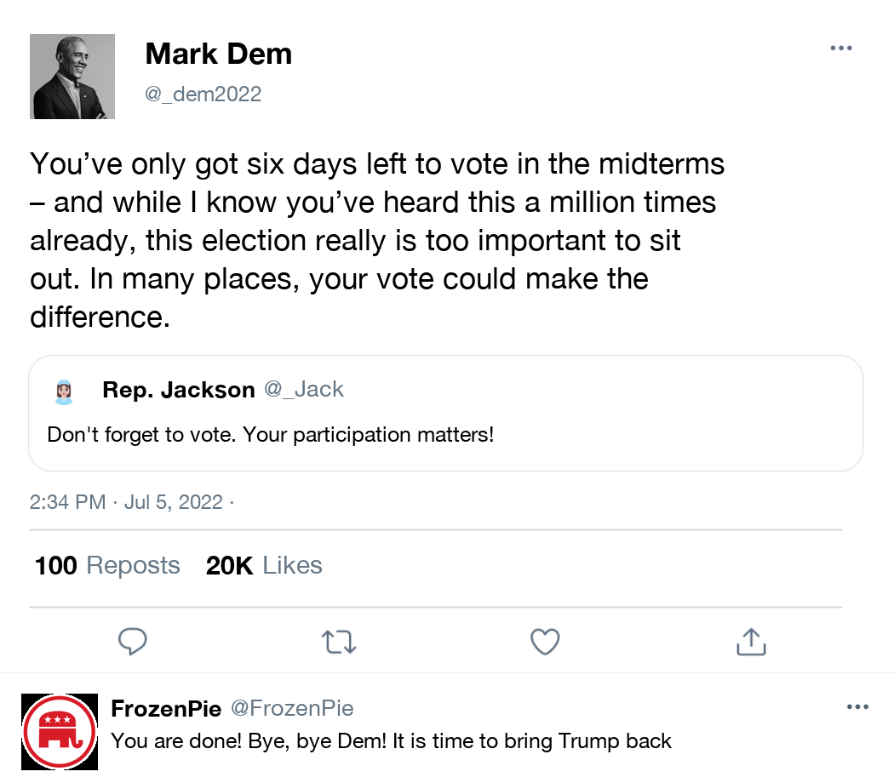

## ConjointTweets: Generating image-based conjoint tweets programmatically

This repository implements a python program to generate conjoint
image-based tweets programatically and at scale. 

The purpose of this tool is to facilitate the work for researchers interested in running survey experiments using images as conjoints, instead of text-based implementations.  

This is a work in progress and part of my ongoing collaboration with Kevin Munger (Penn State), Katherine McCabe (Rutger University) and Keng-Chi Chang (UCSD) -- who wrote a big part of this code.

## Demos

In addition to this readme, we prepared two demos explaining how to use
our functions. See below for R and Python users:

-   [demo to use in
    R](https://htmlpreview.github.io/?https://github.com/TiagoVentura/conjoints_tweets/blob/83e1b98d3fd959c8f320b2104a199c8053ad3a53/demo-R.html)
-   [demo to use in
    python](https://htmlpreview.github.io/?https://github.com/TiagoVentura/conjoints_tweets/blob/83e1b98d3fd959c8f320b2104a199c8053ad3a53/demo-Python.html)

## Setup

## Calling packages

``` python
# import packages
from matplotlib import font_manager
from PIL import Image, ImageDraw, ImageFont
from textwrap import wrap
import os
import re
import datetime
from numpy import asarray
```

## Python function to write the tweets and quote tweets

We wrote a python function that allows researcher to create tweets and
quote tweets given a set of inputs. The function has the following
parameters:

-   `CreateTweet()`: Create tweet using parameters.
-   Parameters:
    -   `author_avatar` (str): avatar of author
    -   `author_name` (str): name of author
    -   `author_tag` (str): twitter username/handle of author
    -   `text` (str): main text of tweet
    -   `reactions_retweet` (str): number of reactions of tweet
    -   `reactions_quote` (str): number of quotes of tweet
    -   `reactions_like` (str): number of likes of tweet
    -   `time` (str/NULL/None): time of tweet in format “2022-07-05
        14:34”; if None use current time
    -   `quote` (TRUE/FALSE): whether or not to print quoted tweet
    -   `quote_author_avatar` (str): avatar of author of quoted tweet
    -   `quote_author_name` (str): name of author of quoted tweet
    -   `quote_author_tag` (str): twitter username/handle of author of
        quoted tweet
    -   `quote_text` (str): text of quoted tweet
    -   `reply` (True/False): whether or not to print quoted tweet
    -   `reply_author_avatar` (str): avatar of author of quoted tweet
    -   `reply_author_name` (str): name of author of quoted tweet
    -   `reply_author_tag` (str): twitter username/handle of author of quoted tweet
    -   `reply_text` (str): text of quoted tweet
-   Returns:
    -   image: Twitter image in PIL Image format

You can get access to the function on this repository. The logic of the
function is to split the tweet in many parts, and combine their
positions at the end. These components can all be rotated in a conjoint
experiment.

## CreateTweet

A simple example using the CreateTweet.

``` python
from conjoint_tweets import *
tweet = CreateTweet()
SaveTweet(tweet, "output/tweet.png", quality = 95)
```


## QuoteTweet

To generate a quote tweet, you just need to add quote=True

``` python
qt = CreateTweet(quote=True)
SaveTweet(qt, "output/tweet_quote.png", quality = 95)
```


## Tweet with reply

To generate a tweet with reply, you just need to add reply=True

``` python
qt = CreateTweet(quote=True, reply=True)
SaveTweet(qt, "output/tweet_quote_reply.png", quality = 95)
```


## Example with real content

```python
image = CreateTweet(
    author_avatar="input/avatar/obama_avatar.jpeg",
    author_name="Mark Dem",
    author_tag="@_dem2022",
    text="You’ve only got six days left to vote in the midterms – and while I know you’ve heard this a million times already, this election really is too important to sit out. In many places, your vote could make the difference.",
    reactions_retweet="100",
    reactions_quote="200",
    reactions_like="20K",
    time="2022-07-05 14:34",
    quote=TRUE,
    quote_author_avatar="input/avatar/woman3_clean.png",
    quote_author_name="Rep. Jackson",
    quote_author_tag="@_Jack",
    quote_text="Don't forget to vote. Your participation matters!",
    reply=TRUE,
    reply_author_avatar="input/avatar/republican.png",
    reply_author_name="FrozenPie",
    reply_author_tag="@FrozenPie",
    reply_text="You are done! Bye, bye Dem! It is time to bring Trump back")
```



## Generating Conjoints

The final step is to generate multiple images for a conjoint setup. This can be easily done with an any type of functional programming technique. We show here how you can generate multiple conjoint tweets with a simple nested loop. 

Notice we use the enumerate function so that we can easily recover all the variations of the conjoint directly from the file names. 

``` python 
# import pandas
import pandas as pd
# create a  tweet varying author name, text, and number of reactions to the tweet. 
for a, author in enumerate(author_name):
  for b, text in enumerate(texts):
    for c, retweet in enumerate(reactions_retweet):
      for d, quote in enumerate(reactions_quote):
        for e, like in enumerate(reactions_like):
          # generate image
          tweet = CreateTweet(
                    author_avatar="input/avatar/woman_clean.png",
                    author_name=author[0],
                    author_tag=author[1],
                    text=text,
                    reactions_retweet=retweet,
                    reactions_quote=quote,
                    reactions_like=like,
                    time="2022-07-05 14:34")
          # to save
          name = ["author_" + str(a+1), 
                  "text_" + str(b+1),
                  "retweet_"+ str(c+1), 
                  "quote_"+ str(d+1), 
                  "like_" + str(e+1)]
          output= '_'.join(name) + ".png"
          # save
          outdir= "Output/"
          SaveTweet(tweet, outdir+output, quality=95)
```


## Embedding the Conjoint on a survey platform. 

The next step is to embed all the conjoint images in a survey platform, and perform the randomization. We propose a easy solution for this task. Using the R package `plumber` we develop a simple API to randomize accross all the imges saved on the folder output. Then, we add the API endpoint as an embedded to your survey platform. In our case, we use Qualtrics, and use the webservice function in the survey workflow to send requests to the API. 

All the materials for the API are available in the folder `api_conjoint_tweets`. The api has two simple files:

- `run_api.r`: this file is responsible for deploying the api

- `plumber.r`: this file contains the function to generate the api requests.

We hosted the API at a AWS RStudio server. However, the images and the api can be hosted in any type of server. 

[Here](https://mblukac.github.io/posts/2021/05/plumber_AWSEC2/) you can find a nice tutorial writen by Martin Lukac on how to deploy a `pumbler` API with AWS EC2

If you don't want go through all these steps, fell free to manually upload the images to qualtrics, and add the randomization directly to your survey. 

## Similar work

The code is inspired in two main related works.

-   This medium post
    [here](https://medium.com/analytics-vidhya/how-to-create-twitter-screenshots-with-python-c142ef71fda7)
    describing how to generate tweets’ screenshots in Python.

-   And Alessandro Vecchiato
    [implementation](https://github.com/avecchiato/Introducing_Visual_Conjoints)
    of visual conjoints for Twitter profiles.
    
This is a work in progress. Suggestions are more than welcome!
