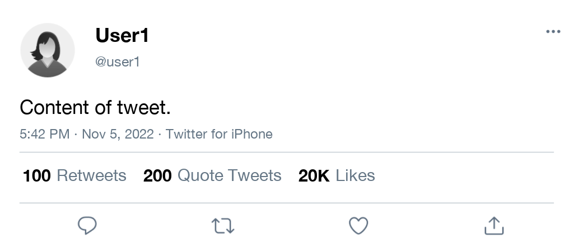

## Generating tweets programmatically

This document implements a python program to generate conjoint
image-based tweets programatically and at scale. The code is inspired in
two main sources with similar implementation.

-   This medium post
    [here](https://medium.com/analytics-vidhya/how-to-create-twitter-screenshots-with-python-c142ef71fda7)
    describing how to generate tweets’ screenshots in Python.

-   And Alessandro Vecchiato
    [implementation](https://github.com/avecchiato/Introducing_Visual_Conjoints)
    of visual conjoints for Twitter profiles.

This is a work in progress and part of my ongoing collaboration with
Kevin Munger (Penn State), Katherine McCabe (Rutger University) and
Keng-Chi Chang (UCSD). Keng-Chi Chang made invaluable contributtions to
this code.

## Demos

In addition to this readme, we prepared two demos explaining how to use
our functions. See below for R and Python users:

-   [demo to use in
    R](https://htmlpreview.github.io/?https://github.com/KengChiChang/conjoints_tweets/blob/modularize/demo-R.html)
-   [demo to use in
    python](https://htmlpreview.github.io/?https://github.com/KengChiChang/conjoints_tweets/blob/modularize/demo-Python.html)

## Setup

## Calling packages

``` python
# import packages
from matplotlib import font_manager
from PIL import Image, ImageDraw, ImageFont
from textwrap import wrap
import os
import re
import datetime
from numpy import asarray
```

## Python function to write the tweets and quote tweets

We wrote a python function that allows researcher to create tweets and
quote tweets given a set of inputs. The function has the following
parameters:

-   `CreateTweet()`: Create tweet using parameters.
-   Parameters:
    -   `author_avatar` (str): avatar of author
    -   `author_name` (str): name of author
    -   `author_tag` (str): twitter username/handle of author
    -   `text` (str): main text of tweet
    -   `reactions_retweet` (str): number of reactions of tweet
    -   `reactions_quote` (str): number of quotes of tweet
    -   `reactions_like` (str): number of likes of tweet
    -   `time` (str/NULL/None): time of tweet in format “2022-07-05
        14:34”; if None use current time
    -   `quote` (TRUE/FALSE): whether or not to print quoted tweet
    -   `quote_author_avatar` (str): avatar of author of quoted tweet
    -   `quote_author_name` (str): name of author of quoted tweet
    -   `quote_author_tag` (str): twitter username/handle of author of
        quoted tweet
    -   `quote_text` (str): text of quoted tweet
-   Returns:
    -   image: Twitter image in PIL Image format

You can get access to the function on this repository. The logic of the
function is to split the tweet in many parts, and combine their
positions at the end. These components can all be rotated in a conjoint
experiment.

## CreateTweet

A simple example using the CreateTweet.

``` python
from conjoint_tweets import *
tweet = CreateTweet()
SaveTweet(tweet, "output/tweet.png", quality = 95)
```



## QuoteTweet

To generate a quote tweet, you just need to add quote=true

``` python
qt = CreateTweet(quote=True)
SaveTweet(qt, "output/qttweet.png", quality = 95)
```


## Another Example

Now let’s see an example with inputs we provide to the function

``` python
img = CreateTweet(
    author_avatar="input/avatar/woman_clean.png",
    author_name="Daydream Whale",
    author_tag="@DaydreamWhale",
    text="Grim-visaged war hath smooth'd his wrinkled front; And now, instead of mounting barded steeds. To fright the souls of fearful adversaries, He capers nimbly in a lady's chamber. To the lascivious pleasing of a lute.",
    reactions_retweet="100",
    reactions_quote="200",
    reactions_like="20K",
    time="2022-07-05 14:34",
    quote=True,
    quote_author_avatar="input/avatar/woman_clean.png",
    quote_author_name="Mobsteroid",
    quote_author_tag="@mobsteroid",
    quote_text="Now is the winter of our discontent. Made glorious summer by this sun of York; And all the clouds that lour'd upon our house. In the deep bosom of the ocean buried. Now are our brows bound with victorious wreaths. Our bruised arms hung up for monuments. Our stern alarums changed to merry meetings, Our dreadful marches to delightful measures."
)
img.save('output/tweet_quote.png', quality=95)
```


## Rotating to generate the conjoints

The final step is just to write a nested loop to iterate over several
parameters

<!-- See an example below -->
<!-- Done! From here you just need to upload those in your survey and run the experiments. In future iterations of this code, I hope to show how to easily connect these images with Qualtrics -->
